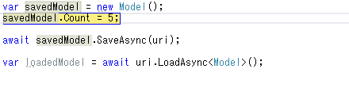
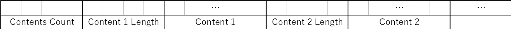

Encodable = En + Codable
====

`Encodable` enables objects to be encoded, decoded, loaded and saved.

## Description

C# didn't have any united interface to I/O objects. We had to implement some loader and saver when we want to store and restore data. Most of you may have used System.IO.File or System.Xml.XmlDocument and so on. Encodable gives you a very simple interface for data management like Swift's Codable protocol.

### Word definitions

- Encode = Object -> `Data`
- Decode = `Data` -> Object
- Load = Some resource -> `Data` or Object
- Save = `Data` or Object -> Some resource

## Demo



## VS. 

### `System.Runtime.Serialization`

For more formats (e.g. JSON, XML, etc.), you should use `System.Runtime.Serialization`. `Encodable` provides only byte sequence functions.

## Requirement

`Encodable` is written with .NET 6.0 C# so reqires .NET 6.0.

However, you can fix the code and can adapt to older frameworks.

## Usage

### Make Objects Codable

First, implement `ICodable` to the model object. Fields whose name starts with `_` are subject to search. `ICodable` objects must have a constructor without parameters.

```
class Model : ICodable
{
    private bool _SomeProperty;
    public bool SomeProperty { get => _SomeProperty; set => _SomeProperty = value; }
}
```

### Save

```
// Make the model.
Model model = new Model();
model.SomeProperty = true;

// Save the model.
Uri uri = new Uri(Path.GetFullPath("file.binary"));
await model.SaveAsync(uri);
```

### Load

```
// Load the model.
Uri uri = new Uri(Path.GetFullPath("file.binary"));
Model model = await uri.LoadAsync<Model>();
```

### Structural Object

Model objects can contain fields of the below type.

- Primitives (`bool`, `char`, `double`, `Half`, `short`, `int`, `long`, `float`, `ushort`, `uint`, `ulong`)
- `string`
- `DateTime`
- Collections (`List`, `Dictionary`, ...)
- `ICodable`

This model is also OK.

```
class Model : ICodable
{
    private List<int> _SomeCollection = new List<int>();
    public List<int> SomeCollection => _SomeCollection;
    private Dictionary<string, int> _SomeDictionary = new Dictionary<string, int>();
    public Dictionary<string, int> SomeDictionary => _SomeDictionary;
    private SubModel _SubModel = new SubModel();
    public SubModel SubModel => _SubModel;
}

class SubModel : ICodable
{
    private double _SomeProperty;
    public double SomeProperty { get => _SomeProperty; set => _SomeProperty = value; }
}
```

### Change Prefix

You can also change the field search condition. Update `CodingProperties.Prefix` before loading and saving.

```
class Model : ICodable
{
    private bool EncodableSomeProperty;
    public bool SomeProperty { get => EncodableSomeProperty; set => EncodableSomeProperty = value; }
}
```

```
// Change the prefix.
CodingProperties.Prefix = "Encodable";
```

### Define Custom Encoder and Decoder

Do you want to use more types? You can define custom encoders and decoders. Define and register them before encoding and decoding.

```
record Person
{
    public string Name { get; init; } = "";
    public int Age { get; init; }
}

static class PersonExtension
{
    public static Data Encode(this Person person)
    {
        Data nameData = person.Name.Encode();
        Data ageData = person.Age.Encode();
        return new Data(nameData, ageData);
    }
    
    public static Person Decode(this Person _, Data data, Type? __ = null)
    {
        List<Data> contents = data.Contents.ToList();
        return new Person
        {
            Name = contents[0].Decode<string>(),
            Age = contents[1].Decode<int>(),
        };
    }
}

class Model : ICodable
{
    private Person _Person = new Person();
    public Person Person { get => _Person; set => _Person = value; }
}
```

```
// Register the encoder and the decoder.
CodingProperties.AddCoder<Person>(PersonExtension.Encode, PersonExtension.Decode);
```

Custom coding is faster than `ICodable` coding. Of course, you can put this `Person` into some collection, too.

### Collections

Usable collections have these constraints.

- Implement `IEnumerable` AND Have a constructor with a parameter of `IEnumerable`
- Implement `IDictionary` AND Have a constructor with a parameter of `IEnumerable<KeyValuePair>` AND Iterable with `DictionaryEntry`

### `Data` Class

`Data` class wrap byte collection.



Refer to `Data.RawBytes` when you operate bytes. 

## Install

1. Clone or download the vs shared project.
2. Add `Encodable` to your solution.
3. Add a reference to `Encodable` in your project.

## Contribution

1. Fork it ( https://github.com/HotariTobu/Encodable )
2. Create your feature branch (git checkout -b my-new-feature)
3. Commit your changes (git commit -am 'Add some feature')
4. Push to the branch (git push origin my-new-feature)
5. Create a new Pull Request

## Licence

[UNLICENCE](LICENCE)

## Author

[HotariTobu](https://github.com/HotariTobu)
